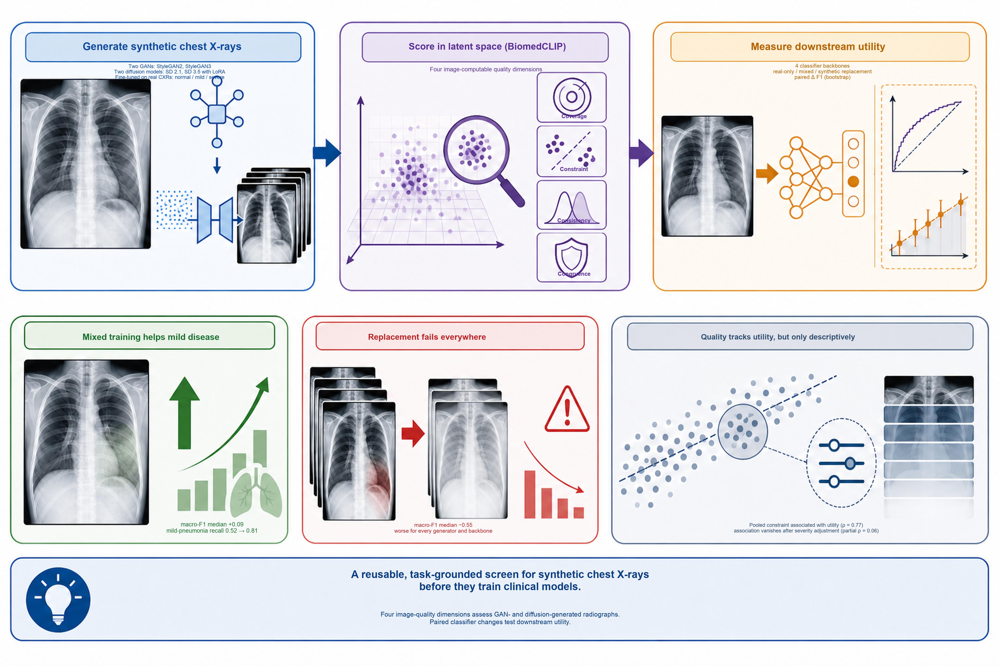

# Task-Grounded Latent-Space Evaluation of Synthetic Chest X-rays for Downstream Classification

Code accompanying the manuscript **“Task-Grounded Latent-Space Evaluation of Synthetic Chest X-rays for Downstream Classification.”** The repository implements a task-grounded evaluation of synthetic chest X-rays across four image-computable dimensions and relates those measurements to paired changes in downstream pneumonia-severity classification.

## Authors

Zhaohui Liang, PhD; Sivaramakrishnan Rajaraman, PhD; Niccolo Marini, PhD; Zhiyun Xue, PhD; Sameer Antani, PhD

Division of Intramural Research, National Library of Medicine, National Institutes of Health, Bethesda, Maryland, USA. Correspondence: sameer.antani@nih.gov.

## Abstract

Synthetic medical images are increasingly proposed to address data scarcity in clinical artificial intelligence, but image quality and downstream utility are usually reported as separate endpoints. We evaluated whether image-computable quality measures correspond to the downstream value of synthetic chest X-rays. We assessed four quality dimensions: congruence, coverage, constraint, and consistency. Six generator configurations were derived from two generative adversarial networks (GANs) and two diffusion models. Coverage, constraint, and consistency were computed in a biomedical vision–language embedding space (BiomedCLIP). Three-class pneumonia-severity classification was evaluated on 300 held-out real chest X-rays across four backbones under a real-only baseline, two mixed real–synthetic strategies, and complete synthetic replacement of real diseased images. No generator ranked best across all measures; pairwise rank correlations among quality measures ranged from −0.59 to 0.69. At a cosine-distance threshold of 0.20, severe-pneumonia coverage reached at least 97.0% for both GANs but did not exceed 1.5% for Stable Diffusion 3.5. Mixed training improved macro-F1 in all 48 generator–backbone comparisons (medians +0.09 and +0.08), but gains arose predominantly from mild-pneumonia recall (medians +0.29 and +0.27) and coexisted with reduced severe-pneumonia recall (medians −0.08 and −0.09), whereas macro area under the receiver operating characteristic curve rose by only +0.02. Complete replacement reduced macro-F1 in all 24 comparisons (median −0.55). Pooled constraint–utility correlations (ρ = 0.77 and 0.83) attenuated after severity adjustment (ρ = 0.06 and 0.29). Synthetic-image quality and utility are therefore conditional on disease phenotype and training role, supporting fitness-for-use evaluation rather than a universal quality score.

## Graphical abstract



## What is implemented

- **Congruence:** conventional Inception-feature FID and KID, raw CLIP image–text similarity with the fixed prompt `pneumonia, chest x-ray`, and paired PSNR for image-to-image outputs only.
- **Coverage:** the fraction of real reference images with a synthetic neighbor below each cosine-distance threshold, plus nearest-neighbor distance summaries and normalized coverage-curve area (Algorithm S1).
- **Constraint:** cosine similarity of each synthetic image to the normalized real-class centroid.
- **Consistency:** the signed synthetic-minus-real mean-similarity gap and the synthetic-to-real dispersion ratio. Algorithm S2 traceability fields are also returned.
- **Downstream utility:** paired changes from a matched real-only baseline, estimated with a class-stratified image-level bootstrap.
- **Quality–utility association:** pooled Spearman correlation, generator-cluster bootstrap intervals, permutation tests, and severity-adjusted partial-rank analysis.

These analyses evaluate association and fitness for the specified task. They do not establish out-of-sample prediction of augmentation utility.

## Repository layout

```text
assets/                  Graphical abstract
docs/algorithms/         Algorithms S1/S2 and legacy TeX descriptions
notebooks/               Original exploratory notebooks, reorganized and renamed
scripts/                 Reusable command-line entry points
src/synthetic_data_evaluation/
                         Tested metric and statistical-analysis functions
tests/                   Unit tests with small synthetic examples
```

The original notebooks are retained for provenance. They may contain historical paths or exploratory choices. Use the scripts and `src/` package for reproducible analyses aligned with the finalized manuscript.

## Installation

Python 3.10 or later is recommended.

```bash
git clone https://github.com/antani-lab/synthetic_data_evaluation_CLIP.git
cd synthetic_data_evaluation_CLIP
python -m venv .venv
source .venv/bin/activate
python -m pip install --upgrade pip
python -m pip install -e ".[all]"
```

The base installation supports analyses from precomputed embeddings and prediction files. The `all` extra also installs BiomedCLIP/OpenCLIP, CleanFID, PyTorch, and image-processing dependencies.

## Expected inputs

Images and fine-tuned model weights are not distributed in this repository. Image directories may contain PNG, JPEG, BMP, or TIFF files. Embeddings may instead be supplied as a two-dimensional `.npy` array or an `.npz` archive with an `embeddings` key.

For the finalized study, coverage and centroid analyses used 200 independent real reference images and 1,000 synthetic images for each generator–severity combination. Images were converted to RGB and processed with the transform associated with:

```text
hf-hub:microsoft/BiomedCLIP-PubMedBERT_256-vit_base_patch16_224
```

The package L2-normalizes all embedding rows before cosine calculations.

## Reproduce the quality analyses

Precompute embeddings when working directly from images:

```bash
python scripts/embed_images.py data/real_mild outputs/real_mild.npz \
  --weights checkpoints/biomedclip_visual.pt
```

Compute the complete coverage curve. The default thresholds are 0.05, 0.10, 0.15, 0.20, and 0.25, and the published definition uses strict `distance < threshold`:

```bash
python scripts/compute_coverage.py \
  --real outputs/real_mild.npz \
  --synthetic outputs/stylegan2_mild.npz \
  --generator stylegan2 --severity mild \
  --output results/coverage_stylegan2_mild.csv
```

Compute constraint and consistency:

```bash
python scripts/compute_constraint_consistency.py \
  --real outputs/real_mild.npz \
  --synthetic outputs/stylegan2_mild.npz \
  --generator stylegan2 --severity mild \
  --output results/constraint_consistency_stylegan2_mild.csv
```

Compute conventional congruence measures from image directories:

```bash
python scripts/compute_congruence.py \
  --real data/real_mild --synthetic data/stylegan2_mild \
  --output results/congruence_stylegan2_mild.json
```

Add `--paired-psnr` only when filenames define direct, pixel-aligned image-to-image pairs. PSNR is not computed for GAN or text-to-image outputs because they have no natural one-to-one reference.

## Reproduce downstream comparisons

`evaluate_predictions.py` expects one row per held-out image, an image identifier, a class label, and one probability column per class. Baseline and condition files must contain the same image identifiers and labels.

```bash
python scripts/evaluate_predictions.py \
  --baseline predictions/real_only.csv \
  --condition predictions/aug1_stylegan2.csv \
  --probability-columns probability_normal probability_mild probability_severe \
  --output results/aug1_stylegan2_paired_bootstrap.csv
```

The script reports overall accuracy, class-specific recall, class-specific and macro-F1, and macro one-versus-rest ROC-AUC. It uses 5,000 class-stratified paired bootstrap samples by default.

For the direct quality–utility analysis, prepare a long-form CSV with these columns:

```text
dimension,generator,severity,quality,utility
```

Here, `utility` is the change in class-specific F1 from the matched real-only baseline, averaged across the four fixed backbone architectures for each generator–severity combination.

```bash
python scripts/analyze_quality_utility.py \
  results/quality_utility_long.csv \
  results/quality_utility_associations.csv
```

## Statistical conventions

- The downstream experimental unit is the image.
- Baseline and augmented models are compared on identical held-out images.
- Bootstrap sampling is stratified by class and preserves pairing between model conditions.
- Backbone architecture is a fixed design factor and should be reported separately.
- Multiplicity across generator or mode comparisons within a prespecified family is handled with Holm adjustment.
- The quality–utility analysis uses class-specific F1 change; positive values indicate improvement and negative values indicate worse classification relative to real-only training.

## Tests

```bash
python -m pytest
```

## Algorithms and manuscript traceability

The supplied [Algorithm S1](docs/algorithms/algorithm_S1.pdf) and [Algorithm S2](docs/algorithms/algorithm_S2.pdf) are preserved under `docs/algorithms/`. The Python implementation follows the finalized manuscript when historical notebook or TeX definitions differ. In particular, no ANOVA is performed in Algorithm S2, and consistency is reported using the manuscript's signed mean gap and dispersion ratio. The optional leave-one-out real-centroid sensitivity analysis can be enabled with `--leave-one-out-real`.

## Data and model availability

The repository does not redistribute MIDRC or IUHN-CXR images, synthetic images, classifier predictions, or fine-tuned weights. Obtain the source datasets under their respective access conditions and organize local paths as described above. Do not commit protected health information, credentials, or restricted data.

## Citation

Please cite both the repository and associated manuscript when using this code:

> Liang, Z., Rajaraman, S., Marini, N., Xue, Z., Antani, S., 2026. Task-Grounded Latent-Space Evaluation of Synthetic Chest X-rays for Downstream Classification [software]. GitHub. https://github.com/antani-lab/synthetic_data_evaluation_CLIP.

A machine-readable citation is provided in [`CITATION.cff`](CITATION.cff). Add the journal citation and DOI after publication.

## License

This project is released under the [MIT License](LICENSE).
